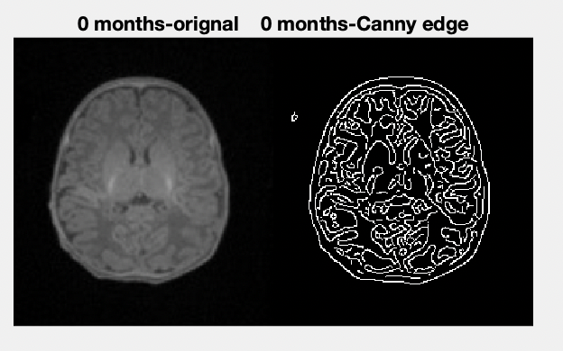
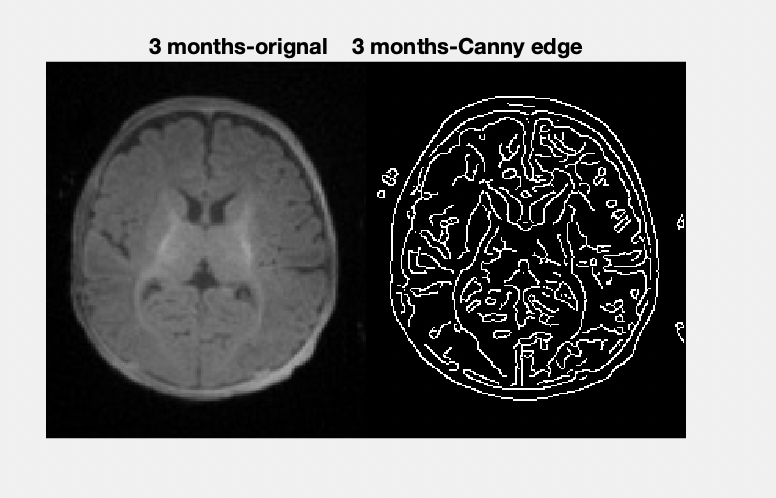

# Proof_of_concept_Canny_edge_detection_in_infant_neuroimaging
Test to see how well Canny edge detection works with infant neuroimaging data

 Since, to the best of my knowledge no body has tested how Canny edge detection works on infant neuroimaging datasets. I have decided to investigate how good is Canny edge detection is at characterizing edges in infant's brain images from a single slice for an infant that is 0 months and 3 months old. I hope this little proof of concept helps in the development of neuroimaging toolboxes to enable one to analysis neuroimaging datesets from infants. 

 

 
